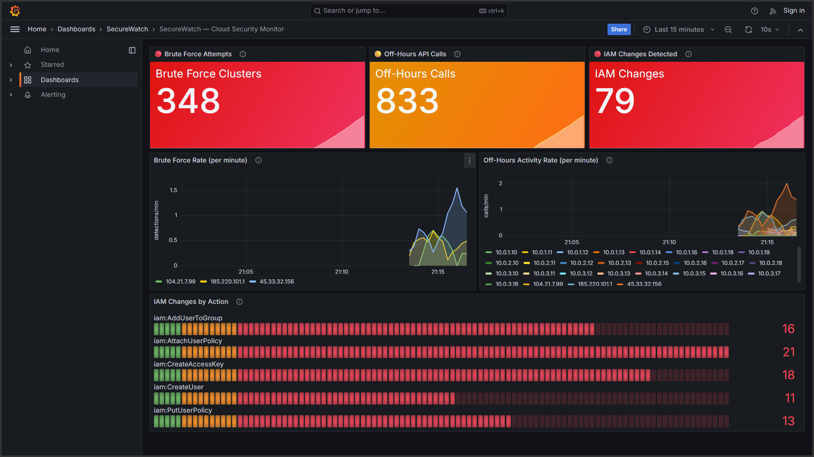
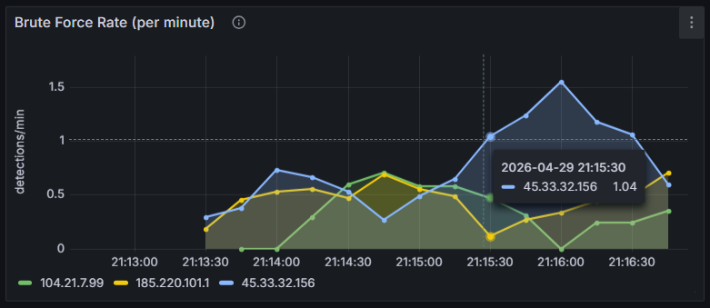
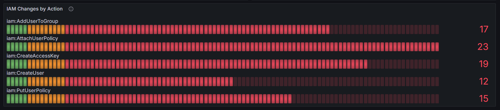
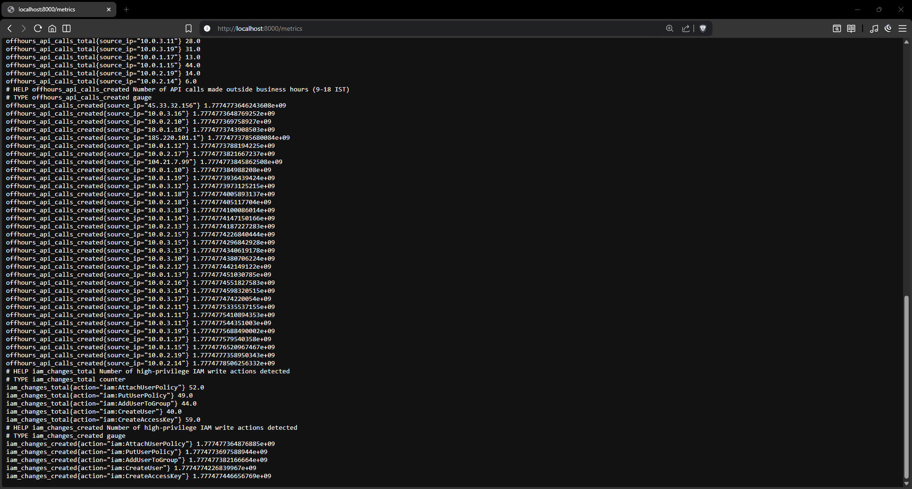
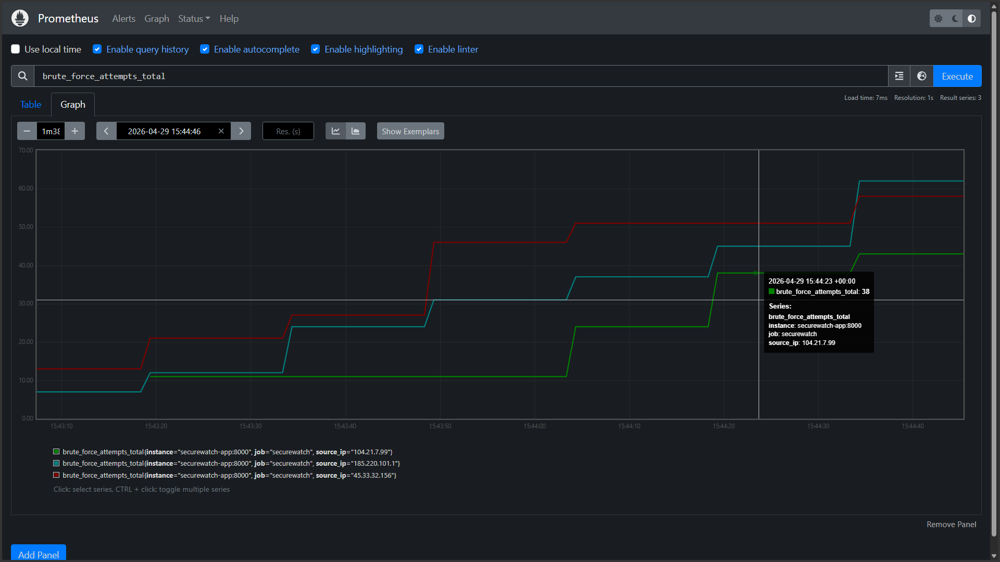

# SecureWatch — Cloud Security Monitoring Dashboard

A lightweight, self-contained security monitoring system that simulates AWS
CloudTrail log analysis with real-time anomaly detection, Prometheus metrics,
and a live Grafana dashboard.

---

## Demo Video

> A short walkthrough of the application starting up and the dashboard loading live.

<!-- 
  REPLACE the src below with your actual video file path or hosted URL.
  Example (local file): <source src="demo/securewatch-demo.mp4" type="video/mp4">
  Example (YouTube embed): use an <iframe> instead (see bottom of this section).
-->

<video width="100%" controls>
  <source src="demo/securewatch-demo.mp4" type="video/mp4">
  Your browser does not support the video tag. <a href="demo/securewatch-demo.mp4">Download the demo video</a>.
</video>

---

## Screenshots

### Dashboard Overview — All Three Stat Panels

*The main SecureWatch dashboard showing brute force, off-hours, and IAM change counters immediately after startup.*

### Brute Force Rate Graph

*Time-series graph showing rate of brute-force detection spikes per minute, broken down by attacker IP.*

### IAM Changes Bar Gauge

*Horizontal bar gauge showing which IAM write actions have been triggered (e.g. AttachUserPolicy, CreateUser).*

### Raw Prometheus Metrics Endpoint

*Raw /metrics output at http://localhost:8000/metrics in Prometheus text exposition format.*

### Prometheus Query — brute_force_attempts_total

*PromQL query result at http://localhost:9090 showing the brute_force_attempts_total counter over time.*

---

## Architecture

```
┌──────────────────────────────────────────────────────────┐
│                     Docker Compose                       │
│                                                          │
│  ┌─────────────────────────────────────┐                 │
│  │  securewatch-app (port 8000)        │                 │
│  │                                     │                 │
│  │  mock_logs.py ──► ingester.py       │                 │
│  │       │               │             │                 │
│  │  (generates       (feeds events     │                 │
│  │   fake AWS         to detector)     │                 │
│  │   CloudTrail)          │            │                 │
│  │                   detector.py       │                 │
│  │                   (3 rules)         │                 │
│  │                        │            │                 │
│  │                   metrics.py        │                 │
│  │                   GET /metrics      │                 │
│  └────────────┬────────────────────────┘                 │
│               │ scrape every 15s                         │
│  ┌────────────▼──────────┐                               │
│  │  Prometheus (port 9090)│                              │
│  │  stores time-series   │                               │
│  └────────────┬──────────┘                               │
│               │ PromQL queries                           │
│  ┌────────────▼──────────┐                               │
│  │  Grafana   (port 3000) │                              │
│  │  auto-provisioned      │                              │
│  │  dashboard             │                              │
│  └───────────────────────┘                               │
└──────────────────────────────────────────────────────────┘
```

---

## How to Run Locally

### Prerequisites

- Docker Desktop (or Docker Engine + docker-compose)
- Git

### Steps

```bash
# 1. Clone / navigate to the project
cd securewatch

# 2. Build and start all three services
docker-compose up --build

# 3. Wait ~20 seconds for Grafana and Prometheus to become healthy, then open:
#    Grafana:    http://localhost:3000
#    Prometheus: http://localhost:9090
#    Metrics:    http://localhost:8000/metrics

# 4. Grafana credentials
#    Username: admin
#    Password: securewatch
```

The dashboard is pre-loaded — no clicks needed. Open
**Dashboards → SecureWatch → SecureWatch — Cloud Security Monitor**.

---

## What Each Alert Means (Security Perspective)

### 🔴 Brute Force Attempts

**What it detects:** 5 or more failed `ConsoleLogin` events from the same IP
address within 60 seconds.

**Why it matters:** This pattern is the fingerprint of automated
*credential stuffing* or *password spray* attacks. An attacker loads a list of
stolen username/password pairs and tries them in rapid succession. A human
mis-typing their password won't hit five failures in under a minute.

**Real-world response:** Block the source IP at the WAF, lock the targeted
accounts, notify the security team.

---

### 🟡 Off-Hours API Calls

**What it detects:** Any AWS API call made outside 9 AM – 6 PM IST
(UTC+5:30).

**Why it matters:** Attackers operate in different time zones. A compromised
credential being used at 3 AM IST on a Tuesday — when every employee is
asleep — is a strong signal of malicious activity. Legitimate automation
(CI/CD pipelines) should be whitelisted by IP or service account, making
unknown off-hours traffic stand out clearly.

**Real-world response:** Alert on-call team, temporarily restrict the account,
audit recent API calls from that credential.

---

### 🔴 IAM Changes

**What it detects:** Any write-level IAM action: `PutUserPolicy`,
`AttachUserPolicy`, `CreateUser`, `CreateAccessKey`, `AddUserToGroup`.

**Why it matters:** IAM changes are the most direct path to privilege
escalation. Attaching `AdministratorAccess` to a user, creating a new
backdoor user, or generating a new access key for an existing user are all
techniques used after initial access is gained. Even during business hours,
these events should be rare and tied to a tracked change-management ticket.

**Real-world response:** Immediately review the change, reverse it if
unauthorised, rotate all credentials belonging to the affected user, audit
CloudTrail for the 24 hours preceding the event.

---

## File Guide

| File | Purpose |
|------|---------|
| `mock_logs.py` | Generates realistic simulated CloudTrail events — brute force bursts, IAM changes, off-hours calls, and normal background traffic |
| `detector.py` | Stateful rule engine — sliding-window brute force, IST time-zone check, IAM action allowlist |
| `ingester.py` | Glue layer — reads the event stream, calls detector, increments Prometheus counters |
| `metrics.py` | FastAPI app — serves `/metrics` (Prometheus text format) and starts the ingester on startup |
| `prometheus.yml` | Tells Prometheus to scrape `securewatch-app:8000/metrics` every 15 s |
| `docker-compose.yml` | Orchestrates all three containers |
| `grafana/provisioning/` | Auto-provisions Prometheus datasource and dashboard folder on Grafana startup |
| `grafana/dashboards/securewatch.json` | Pre-built dashboard with 6 panels (3 stat totals + 2 time-series graphs + 1 bar gauge) |

---

## Stopping the Stack

```bash
# Stop and remove containers
docker-compose down

# Stop and remove containers + volumes (clears Prometheus data)
docker-compose down -v
```
